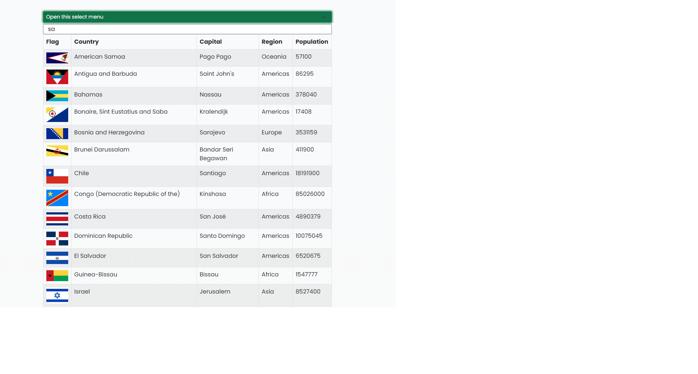

# rest-country-app
<!-- TABLE OF CONTENTS -->

  
Table of Contents

  <ol>
    <li>
      <a href="#about-the-project">About The Project</a>
      <ul>
        <li><a href="#built-with">Built With</a></li>
      </ul>
    </li>
    <li><a href="#contact">Contact</a></li>
  </ol>

<!-- ABOUT THE PROJECT -->
## About The Project
Type value to see currency from USD Dollar to EUR,TRY,RUB,UAH. I also added window.onload to fire getDataOnload() function to show you guys 1 dollar currency immediately when page is loaded. If you want to type another value so you can do it by yourself. For some reason AJAX is not working in Internet but in local it's ok! So please download files to check project

[Project-Link](https://rest-country-app.netlify.app/)

#### JavaScript Used
* Filter
* DOM Manipulation
* addEventListener
* FETCH
* AJAX
* Chainin Method
* Bootstrap

### Built With
* [Javascipt](https://www.javascript.com/)
* [HTML](https://html.com/)
* [CSS](https://css.com/)

<!-- CONTACT -->
## Contact

Furkan Çat - [@FurkanCat](https://twitter.com/FurkanCat) - furi544@gmail.com

Project Link: [Project Link](https://github.com/InsomniumFerum/currency-converter-app)

<!-- MARKDOWN LINKS & IMAGES -->
<!-- https://www.markdownguide.org/basic-syntax/#reference-style-links -->
[contributors-shield]: https://img.shields.io/github/contributors/InsomniumFerum/Best-README-Template.svg?style=for-the-badge
[contributors-url]: https://github.com/InsomniumFerum/Best-README-Template/graphs/contributors
[forks-shield]: https://img.shields.io/github/forks/InsomniumFerum/Best-README-Template.svg?style=for-the-badge
[forks-url]: https://github.com/InsomniumFerum/Best-README-Template/network/members
[stars-shield]: https://img.shields.io/github/stars/InsomniumFerum/Best-README-Template.svg?style=for-the-badge
[stars-url]: https://github.com/InsomniumFerum/Best-README-Template/stargazers
[issues-shield]: https://img.shields.io/github/issues/InsomniumFerum/Best-README-Template.svg?style=for-the-badge
[issues-url]: https://github.com/InsomniumFerum/Best-README-Template/issues
[license-shield]: https://img.shields.io/github/license/InsomniumFerum/Best-README-Template.svg?style=for-the-badge
[license-url]: https://github.com/InsomniumFerum/Best-README-Template/blob/master/LICENSE.txt
[linkedin-shield]: https://img.shields.io/badge/-LinkedIn-black.svg?style=for-the-badge&logo=linkedin&colorB=555
[linkedin-url]: https://www.linkedin.com/in/furkan-%C3%A7at-20174216/
[product-screenshot]: images/project.png
